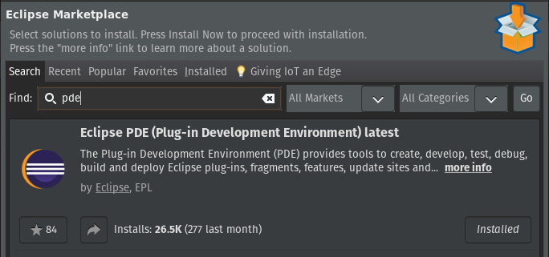
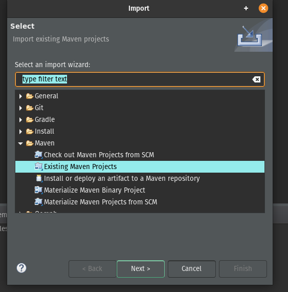
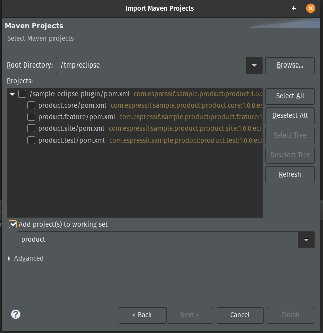
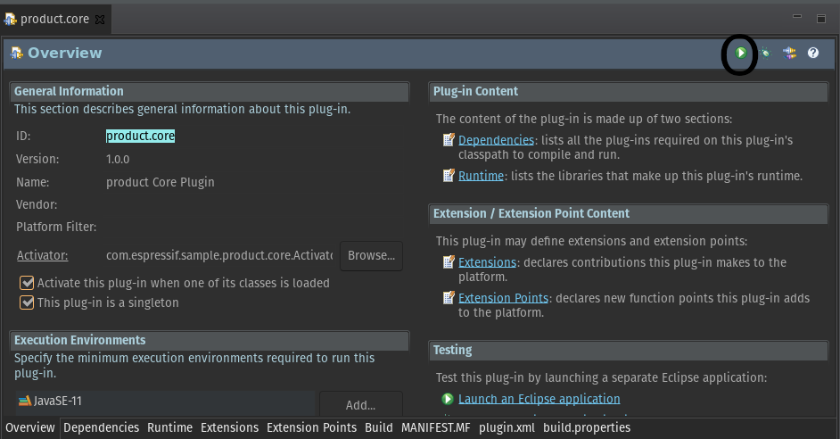
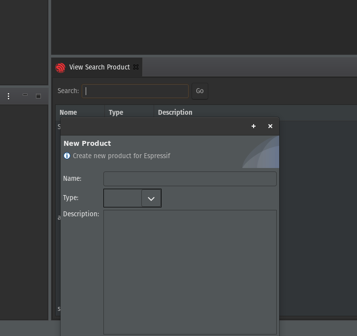

# Sample Eclipse Plugin with Maven

## Requirements

* Java 11 (11.0.7)
* Maven 3 (3.6.3)
* Eclipse 2020-06 (4.16.0)
  * Eclipse PDE (Plug-in Development Environment)

## Quick Start

### Build
```bash
git clone https://github.com/SamuelKlein/sample-eclipse-plugin.git
cd sample-eclipse-plugin
mvn clean verify
```
finish build
```java
.......
Tests run: 7, Failures: 0, Errors: 0, Skipped: 0
[INFO] All tests passed!
[INFO] ------------------------------------------------------------------------
[INFO] Reactor Summary for product :: parent 1.0.0:
[INFO] 
[INFO] product :: parent .................................. SUCCESS [  0.084 s]
[INFO] product :: core .................................... SUCCESS [  1.885 s]
[INFO] product :: feature ................................. SUCCESS [  0.137 s]
[INFO] product :: update site ............................. SUCCESS [  0.942 s]
[INFO] product :: test .................................... SUCCESS [  4.635 s]
[INFO] ------------------------------------------------------------------------
[INFO] BUILD SUCCESS
[INFO] ------------------------------------------------------------------------
[INFO] Total time:  44.654 s
[INFO] Finished at: 2020-09-08T18:53:24-03:00
[INFO] ------------------------------------------------------------------------
```

### Eclipse

Install Plug-in Development Environment


Import Project in File > Import
* Select: Existing Maven Projects



* Browser..., Select all and Finish



### Run Plugin

* Open file /product.core/plugin.xml
* Overview tab.



* click in "Launcher an Eclipse application"
* Open Eclipse with Sample Eclipse Plugin 



### Video Tutorial

https://www.youtube.com/watch?v=IfOfH56TMYI


